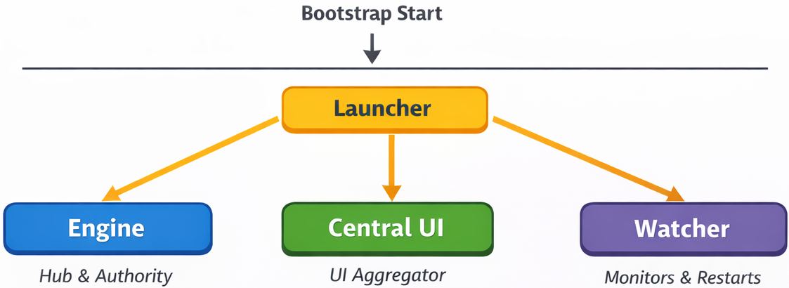

# ARCHITECTURE (final version)

- [Back to Technical TOC](TOC.md)

## 1. Architecture Principles

### 1.1 Strict Frontend / Backend Separation

- **Frontend**: UIs (including the central UI) written in Rust (Dioxus) and distributed as **UI bundles** (WASM + assets).
- **Backend**: services/backends executables (separate processes) that perform tasks (workflows, generation, linting, etc.).

No UI contains business logic. A UI only:

- displays a state,
- sends commands,
- listens to events.

### 1.2 Single Hub and Single Authority

- **Engine** is the **single hub** (WebSocket) and the **execution authority**:
  - authenticates,
  - authorizes,
  - logs (audit),
  - orchestrates,
  - supervises execution,
  - routes commands and events.

`central_ui` is the **UI gateway**: it aggregates UI bundles and proxies UI actions to `engine`.

### 1.3 True Aggregation of UIs (without compile-time dependencies)

The central UI **aggregates** product UIs by loading their bundles **at runtime**.
It is forbidden to "depend" on product UI crates in `central_ui`.

Consequence:

- no global recompilation required to add/update a product UI,
- the central UI remains stable, extensible, and "future proof."

---

## 2. Component Topology

For detailed descriptions of the core components (`engine`, `central_ui`, `watcher`, `launcher`) and products, refer to [Products and Workspace Components](projects/projects_products.md).

---

## 3. Communication and Protocol (Command/Event)

### 3.1 WebSocket Hub

All connections go through `engine`:

- `central_ui` -> `engine` (UI client)
- `product backend` -> `engine` (backend client)
- `launcher` -> `engine` (system client)

UI bundles do not connect to `engine` directly; they run inside `central_ui`, which acts as the single client toward `engine`.

Prohibitions:

- UI bundle <-> engine direct
- UI bundle <-> backend direct
- backend <-> backend direct
- UI <-> UI direct

### 3.2 Command / Event Model

- **Command** (request/response): triggers an action or requests a state.
- **Event** (stream): real-time push notifications.

Examples of commands:

- `ListProjects`
- `ListProducts`
- `ActivateProduct(product_id)`
- `RunWorkflow(project_id, workflow_id)`
- `SpawnBackend(product_id)` (if backend not started)
- `GetStatus(project_id)`

Examples of events:

- `LogLine(project_id, level, message)`
- `Progress(workflow_id, pct)`
- `ProductStateChanged(product_id, state)`
- `WorkflowFinished(workflow_id, result)`

### 3.3 Example: Command/Event Flow

The diagram below reflects the strict communication rules. Product UIs send commands to `central_ui`, which forwards them to `engine`. `engine` calls the product backends and emits events back to UIs through `central_ui`.

Command path: UI → central_ui → engine → backend. Event path: backend → engine → central_ui → UI.

Bootstrap note (startup phase): `launcher` starts the core services (`engine`, `central_ui`, `watcher`). After bootstrap completes, normal command/event flow begins.



```plaintext
                             +---------+
                             | Watcher |
                             +---------+

   +-----------+    +------------+    +---------+    +---------------+
   | Product   | <->| Central UI | <->| Engine  | <->| Product Backend|
   | UI (WASM) |    |  (Gateway) |    |  (Hub)  |    |   (Service)    |
   +-----------+    +------------+    +---------+    +---------------+
```

#### Updated Notes

- **Product UI**: Sends commands to `central_ui`; never talks to backends directly.
- **Central UI**: Gateway between UIs and `engine`; forwards commands and streams events.
- **Engine**: Central hub that authenticates, authorizes, orchestrates, and routes to backends.
- **Product Backend**: Executes commands and emits events through `engine`.
- **Watcher**: Supervises core components (`engine`, `central_ui`, etc.) and restarts them on failure. It is not part of the command/event path.

---

## 4. UI Bundles (central rule)

### 4.1 Definition

A **UI bundle** is a distributable artifact:

- `ui.wasm` (Dioxus WASM)
- `assets/` (icons, css, etc.)
- `ui_manifest.ron` (bundle metadata)

The UI bundle:

- depends on `protocol` + `common`,
- communicates with `engine` **through `central_ui`** (never directly).

### 4.2 UI Rules

- Every product UI is a WASM bundle loaded by `central_ui`.
- A UI never depends on a product backend.
- All actions go through `engine` via `protocol`.

### 4.3 Loading Bundles

`central_ui` loads UI bundles at runtime:

- from the local disk (installation),
- or from `engine` (remote distribution).

`central_ui` does not compile the produced UIs, it **loads** them.

### 4.4 Minimal UI Contract

- Runs inside `central_ui`
- User session authentication (via `central_ui`)
- Send Command / receive Events via `central_ui`

---

## 5. Backend Management

### 5.1 Rule

Backends are separate processes, started and supervised by `engine`.

### 5.2 Lifecycle

When a user opens a product UI or triggers an action:

1. The UI bundle sends a `Command` to `central_ui`.
2. `central_ui` forwards the `Command` to `engine`.
3. `engine` checks auth/permissions.
4. if the backend is not started: `engine` starts it.
5. `engine` routes the command to the backend.
6. the backend publishes `Event` (logs, progress, result).
7. `engine` forwards events to `central_ui`.
8. `central_ui` displays the real-time state.

---

## 6. Registry (source of truth)

### 6.1 Role

The central registry (`.automation_project/registry.json`) is the source of truth for (see [Registry](registry.md)):

- list of products,
- UI bundle paths,
- backend identities,
- versions + schema compatibility.

### 6.2 Rule

No component infers the architecture by implicit scanning without registry.
The registry is **explicit** and versioned.

---

## 7. Security

- `engine` is the only authority:
  - user authentication (UI),
  - machine authentication (backends),
  - permissions,
  - audit log.

`central_ui` displays the permissions returned by `engine` but never decides.

---

## 8. Workspace Structure

```plaintext
automation_project/
|-- projects/
|   |-- products/
|   |   |-- core/
|   |   |   |-- launcher/         # bootstrap
|   |   |   |-- engine/           # WS hub + orchestration + spawn backends
|   |   |   |-- central_ui/       # desktop cockpit, loads UI bundles
|   |   |   `-- watcher/          # external supervision
|   |   |-- <product_x>/
|   |   |   |-- backend/          # backend (binary)
|   |   |   `-- ui/               # UI source (compiles to ui_dist/)
|   |   |       `-- ui_dist/     # packaged artifacts (wasm + assets + manifest)
|   `-- libraries/
|       |-- common/
|       |-- core/
|       |   |-- protocol/
|       |   `-- security_core/
|       |-- security/
|       |-- symbolic/
|       |-- neural/
|       |-- ai/
|       `-- ui/                   # reusable UI components (lib)
```

---

## 9. Initial Products

For details on initial products like `varina`, refer to [Products and Workspace Components](projects/projects_products.md).
